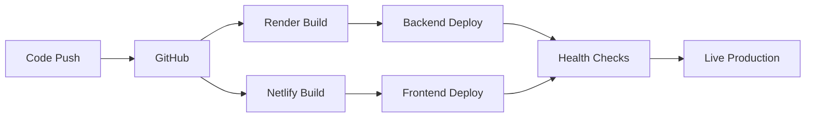

# 🚀 Agent Command Center - Deployment Guide

This guide provides step-by-step instructions for deploying the Agent Command Center to production environments.

## 📋 Prerequisites

Before deployment, ensure you have:
- Node.js 16+ installed locally
- Git installed
- Accounts on:
  - [Supabase](https://supabase.com) (Database)
  - [Render](https://render.com) (Backend hosting)
  - [Netlify](https://netlify.com) (Frontend hosting)
- API keys for external services (if using voice features)

## 🗄️ Database Setup (Supabase)

### 1. Create Supabase Project

1. Go to [Supabase Dashboard](https://app.supabase.com)
2. Click "New Project"
3. Fill in:
   - Project name: `agent-command-center`
   - Database password: (save this securely)
   - Region: Choose closest to your users
4. Click "Create new project"

### 2. Database Schema

Run these SQL commands in the Supabase SQL editor:

```sql
-- Enable UUID extension
CREATE EXTENSION IF NOT EXISTS "uuid-ossp";

-- Create agents table
CREATE TABLE agents (
  id UUID PRIMARY KEY DEFAULT uuid_generate_v4(),
  name VARCHAR(255) NOT NULL,
  type VARCHAR(100) NOT NULL,
  description TEXT,
  status VARCHAR(50) DEFAULT 'inactive',
  personality_traits TEXT[],
  voice_config JSONB DEFAULT '{}',
  capabilities JSONB DEFAULT '{}',
  created_at TIMESTAMPTZ DEFAULT NOW(),
  updated_at TIMESTAMPTZ DEFAULT NOW()
);

-- Create managed_agents table (for local configurations)
CREATE TABLE managed_agents (
  id UUID PRIMARY KEY DEFAULT uuid_generate_v4(),
  name VARCHAR(255) NOT NULL,
  type VARCHAR(100) NOT NULL,
  status VARCHAR(50) DEFAULT 'inactive',
  description TEXT,
  personality JSONB DEFAULT '{}',
  configuration JSONB DEFAULT '{}',
  voice_config JSONB DEFAULT '{}',
  deployment JSONB DEFAULT '{}',
  analytics JSONB DEFAULT '{}',
  tags TEXT[],
  created_at TIMESTAMPTZ DEFAULT NOW(),
  updated_at TIMESTAMPTZ DEFAULT NOW()
);

-- Create platforms table
CREATE TABLE platforms (
  id UUID PRIMARY KEY DEFAULT uuid_generate_v4(),
  name VARCHAR(255) UNIQUE NOT NULL,
  api_endpoint TEXT,
  settings JSONB DEFAULT '{}',
  max_agents INTEGER,
  created_at TIMESTAMPTZ DEFAULT NOW()
);

-- Create agent_deployments table
CREATE TABLE agent_deployments (
  id UUID PRIMARY KEY DEFAULT uuid_generate_v4(),
  agent_id UUID REFERENCES agents(id) ON DELETE CASCADE,
  platform_id UUID REFERENCES platforms(id) ON DELETE CASCADE,
  status VARCHAR(50) DEFAULT 'pending',
  deployed_at TIMESTAMPTZ,
  deployment_config JSONB DEFAULT '{}',
  created_at TIMESTAMPTZ DEFAULT NOW()
);

-- Create deployment_logs table
CREATE TABLE deployment_logs (
  id UUID PRIMARY KEY DEFAULT uuid_generate_v4(),
  deployment_id UUID REFERENCES agent_deployments(id) ON DELETE CASCADE,
  level VARCHAR(20) NOT NULL,
  message TEXT NOT NULL,
  details JSONB DEFAULT '{}',
  created_at TIMESTAMPTZ DEFAULT NOW()
);

-- Create analytics table
CREATE TABLE agent_analytics (
  id UUID PRIMARY KEY DEFAULT uuid_generate_v4(),
  agent_id UUID REFERENCES agents(id) ON DELETE CASCADE,
  period VARCHAR(20) NOT NULL,
  metrics JSONB NOT NULL,
  timestamp TIMESTAMPTZ DEFAULT NOW()
);

-- Insert default platforms
INSERT INTO platforms (name, api_endpoint, max_agents) VALUES
  ('pedro', 'https://pedrobackend.onrender.com', 5),
  ('repconnect1', 'https://osbackend-zl1h.onrender.com', NULL);

-- Create indexes for performance
CREATE INDEX idx_agents_status ON agents(status);
CREATE INDEX idx_deployments_agent ON agent_deployments(agent_id);
CREATE INDEX idx_deployments_platform ON agent_deployments(platform_id);
CREATE INDEX idx_analytics_agent ON agent_analytics(agent_id);
CREATE INDEX idx_analytics_timestamp ON agent_analytics(timestamp);

-- Enable Row Level Security
ALTER TABLE agents ENABLE ROW LEVEL SECURITY;
ALTER TABLE managed_agents ENABLE ROW LEVEL SECURITY;
ALTER TABLE platforms ENABLE ROW LEVEL SECURITY;
ALTER TABLE agent_deployments ENABLE ROW LEVEL SECURITY;
ALTER TABLE deployment_logs ENABLE ROW LEVEL SECURITY;
ALTER TABLE agent_analytics ENABLE ROW LEVEL SECURITY;

-- Create RLS policies (adjust based on your auth strategy)
CREATE POLICY "Enable read access for all users" ON agents FOR SELECT USING (true);
CREATE POLICY "Enable read access for all users" ON platforms FOR SELECT USING (true);
CREATE POLICY "Enable read access for all users" ON agent_deployments FOR SELECT USING (true);
```

### 3. Get Connection Details

1. Go to Settings → API in Supabase
2. Copy:
   - Project URL
   - Anon/Public key
   - Service Role key (keep this secret!)

## 🖥️ Backend Deployment (Render)

### 1. Prepare Backend for Deployment

1. Create `backend/render.yaml`:
```yaml
services:
  - type: web
    name: agent-command-center-backend
    env: node
    region: oregon
    plan: free
    buildCommand: npm install
    startCommand: npm start
    envVars:
      - key: NODE_ENV
        value: production
      - key: PORT
        value: 3001
      - key: SUPABASE_URL
        sync: false
      - key: SUPABASE_ANON_KEY
        sync: false
      - key: SUPABASE_SERVICE_KEY
        sync: false
      - key: ALLOWED_ORIGINS
        value: https://your-netlify-app.netlify.app
      - key: AGENT_BACKEND_URL
        value: https://agentbackend-2932.onrender.com
      - key: PEDRO_BACKEND_URL
        value: https://pedrobackend.onrender.com
      - key: REPCONNECT1_BACKEND_URL
        value: https://osbackend-zl1h.onrender.com
```

2. Update `backend/package.json`:
```json
{
  "scripts": {
    "start": "node server.js",
    "dev": "nodemon server.js"
  },
  "engines": {
    "node": ">=16.0.0"
  }
}
```

### 2. Deploy to Render

1. Push your code to GitHub
2. Go to [Render Dashboard](https://dashboard.render.com)
3. Click "New +" → "Web Service"
4. Connect your GitHub repo
5. Configure:
   - Name: `agent-command-center-backend`
   - Environment: `Node`
   - Build Command: `npm install`
   - Start Command: `npm start`
6. Add environment variables from your `.env` file
7. Click "Create Web Service"

### 3. Configure CORS

Update `ALLOWED_ORIGINS` environment variable with your Netlify URL after frontend deployment.

## 🌐 Frontend Deployment (Netlify)

### 1. Prepare Frontend for Deployment

1. Create `netlify.toml` in root:
```toml
[build]
  command = "npm run build"
  publish = "build"

[build.environment]
  REACT_APP_API_URL = "https://agent-command-center-backend.onrender.com"
  REACT_APP_BACKEND_URL = "https://agent-command-center-backend.onrender.com"
  REACT_APP_WS_URL = "wss://agent-command-center-backend.onrender.com"
  REACT_APP_ENVIRONMENT = "production"

[[redirects]]
  from = "/*"
  to = "/index.html"
  status = 200

[[headers]]
  for = "/*"
  [headers.values]
    X-Frame-Options = "DENY"
    X-Content-Type-Options = "nosniff"
    X-XSS-Protection = "1; mode=block"
    Referrer-Policy = "strict-origin-when-cross-origin"
```

2. Update production environment variables in `.env.production`:
```env
REACT_APP_API_URL=https://your-backend.onrender.com
REACT_APP_BACKEND_URL=https://your-backend.onrender.com
REACT_APP_WS_URL=wss://your-backend.onrender.com
REACT_APP_ENVIRONMENT=production
REACT_APP_SUPABASE_URL=your_supabase_url
REACT_APP_SUPABASE_ANON_KEY=your_supabase_anon_key
```

### 2. Deploy to Netlify

#### Option A: Netlify CLI
```bash
# Install Netlify CLI
npm install -g netlify-cli

# Login to Netlify
netlify login

# Build the project
npm run build

# Deploy to Netlify
netlify deploy --prod --dir=build
```

#### Option B: GitHub Integration
1. Push your code to GitHub
2. Go to [Netlify Dashboard](https://app.netlify.com)
3. Click "Add new site" → "Import an existing project"
4. Connect GitHub and select your repo
5. Configure build settings:
   - Build command: `npm run build`
   - Publish directory: `build`
6. Add environment variables
7. Click "Deploy site"

### 3. Configure Custom Domain (Optional)

1. In Netlify, go to "Domain settings"
2. Add your custom domain
3. Follow DNS configuration instructions

## 🔧 Post-Deployment Configuration

### 1. Update Backend CORS

1. Go to Render dashboard
2. Update `ALLOWED_ORIGINS` with your Netlify URL:
   ```
   https://your-app.netlify.app,https://your-custom-domain.com
   ```

### 2. Test Deployment

Run through this checklist:
- [ ] Frontend loads without errors
- [ ] Can connect to backend API
- [ ] Database queries work
- [ ] WebSocket connection established (or falls back gracefully)
- [ ] Authentication works
- [ ] Agent import from Agent Backend works
- [ ] Voice features work (if enabled)
- [ ] Deployment to Pedro/RepConnect1 works

### 3. Monitor Services

Set up monitoring:
- Render: Built-in metrics and logs
- Netlify: Analytics and function logs
- Supabase: Database metrics and logs
- External monitoring: UptimeRobot, Pingdom

## 🔒 Security Checklist

- [ ] All secrets in environment variables (never in code)
- [ ] HTTPS enabled on all services
- [ ] CORS properly configured
- [ ] Database RLS policies active
- [ ] API rate limiting enabled
- [ ] Input validation on all endpoints
- [ ] Regular security updates

## 🚨 Troubleshooting

### Backend Issues

**Service won't start on Render**
- Check build logs for errors
- Verify all dependencies in package.json
- Ensure start script is correct

**CORS errors**
- Verify ALLOWED_ORIGINS includes frontend URL
- Check for trailing slashes

**Database connection fails**
- Verify Supabase credentials
- Check if Render IP needs whitelisting

### Frontend Issues

**Build fails on Netlify**
- Check for TypeScript errors
- Verify all environment variables set
- Clear cache and retry

**API calls fail**
- Check browser console for errors
- Verify API URL is correct
- Check network tab for response

**Blank page after deployment**
- Check for runtime errors in console
- Verify PUBLIC_URL if using subdirectory
- Check redirect rules

## 📊 Performance Optimization

### Backend
- Enable caching headers
- Use connection pooling for database
- Implement request compression
- Add CDN for static assets

### Frontend
- Enable code splitting
- Lazy load routes
- Optimize images
- Use service workers for caching

## 🔄 Continuous Deployment

### Automated Deployments

1. **Backend (Render)**
   - Auto-deploys on push to main branch
   - Configure branch deploys for staging

2. **Frontend (Netlify)**
   - Auto-deploys on push to main branch
   - Preview deploys for pull requests

### Deployment Pipeline



## 📝 Maintenance

### Regular Tasks
- Update dependencies monthly
- Review error logs weekly
- Monitor performance metrics
- Backup database regularly
- Update API documentation

### Scaling Considerations
- Upgrade Render plan for more resources
- Enable Netlify Functions for serverless
- Consider database replication
- Implement caching layer (Redis)
- Add load balancing

## 🆘 Support

For deployment issues:
1. Check service status pages
2. Review deployment logs
3. Search error messages
4. Contact support:
   - Render: support@render.com
   - Netlify: support@netlify.com
   - Supabase: support@supabase.com

---

Remember to keep your deployment documentation updated as your infrastructure evolves!